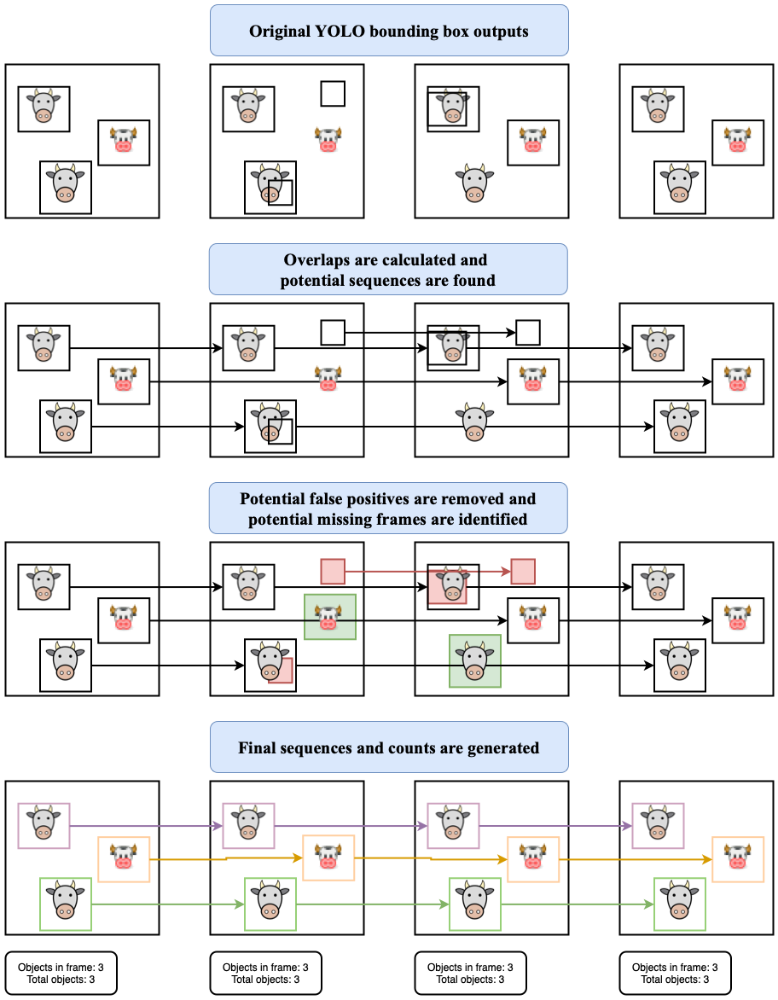
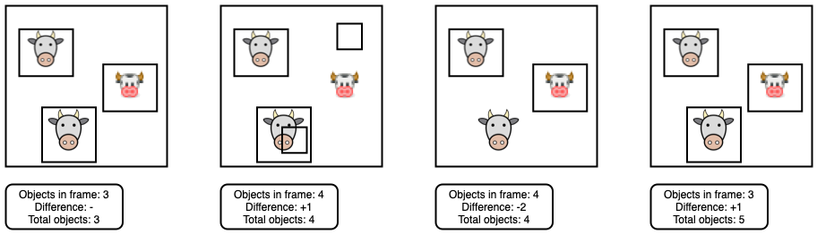

# Official YOLOv7
This repository is a fork of an implementation of the following paper - [YOLOv7: Trainable bag-of-freebies sets new state-of-the-art for real-time object detectors](https://arxiv.org/abs/2207.02696) . This repository also has an implementation of an algorithm that was inspired by [Sequential Non Max Suppression](https://arxiv.org/abs/1602.08465). The new algorithm calculates collates single objects across frames using bounding box overlap to create sequences that enable counting. 

The main files enabling this new algorithm are seq_nms_counting.py and some changes to detect.py

# Goals
This repository introduces a new algorithm for identifying and keeping track of objects across multiple frames. 
* Count the total number of unique objects within a video
* Remove potential false positives from the YOLO detection output
* Restore false negatives
* Produce a video output that has less visual flickering associated with the YOLO outputs

# YOLOv7 and SEQ-NMS for object counting

## What is YOLO?
You only look once (YOLO) is a state-of-the-art, real-time object detection system, that works on individual frames of videos. This enables real time object detection, at the cost of sacrificing information that could be shared between frames such as object permanence. 

## What is SEQ-NMS?
Sequential Non-Maximum-Supreession uses high-scoring object detections from nearby frames to boost scores of weaker detections within the same clip. 

# How it works
The YOLOv7 algorithm treats each frame as an individual scene, and does not aggregate information between frames. Because of this, it is easy to count the number of individual objects of each classification within a frame. However, it is a much more difficult problem to count the total number of unique objects that appear over the course of the video. In order to solve this problem frames need to be aggregated and objects need to be tracked to have some sense of permanence.

The basic steps are to first create a graph of object detections, where each object is connected to objects in the next frames based on the amount of overlap. 
Then the sequences are created following the heaviest weighted paths. 
Next, sequences that are deemed not strong enough were removed. 
Finally, holes in the remaining sequences were patched. This results in a hopefully more smoothed output from the YOLOv7 algorithm, and the ability to count the total number of objects, based on the number of unique sequences detected.
An illustration of the algorithm can be seen below.

    

## See it in Action
[Youtube](https://www.youtube.com/watch?v=g9BFUpx_tk0)

## Benefits over rudimentary approach for object counting
A rudimentary approach would assume that each time the total number of boxes output from YOLOv7 increases, that an object has come into the frame and we should increment the total count of objects. Conversely, when the number decreases an object has left the frame. This becomes an issue because the outputs of YOLOv7 are not very steady, meaning often objects are identified in most frames but not all. Consider the following sequence of frames. Which results in 5 cows, when 3 should be identified. With many frames and many cows, these effects are amplified and the count of cows can become insensibly high.

    

